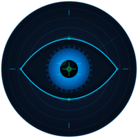

<div align="center">



# Threat Intelligence & Detection Engineering

<p>
  
  
  
  
  
</p>

<p>
  
  &nbsp;
  
  &nbsp;
  
</p>

<br>

> **From threat discovery to 9-platform detection rules in 24 hours.**
>
> Every weekday morning, TI-DE monitors the global threat landscape
> and delivers production-ready detection rules before your team starts work.

</div>

---

## Why TI-DE?

Most detection engineering repos are **static libraries** — you pull rules that someone wrote last week (or last year). TI-DE is a **live pipeline**.

| What others give you | What TI-DE gives you |
|----------------------|----------------------|
| Rules written once, updated occasionally | New rules every weekday morning |
| Single platform (Sigma, Splunk, or Elastic) | **9 platforms simultaneously** |
| Detection rules only | Rules + IoC list + red team simulation guide + PDF report |
| Manual rule writing | Daily threat-to-rule pipeline — 9 platforms, same morning |
| GitHub search required to find relevant rules | Rules organized by CVE/threat/date — instantly findable |
| No validation guidance | Every rule has a paired Atomic Red Team validation scenario |

---

## The Team

Four specialized roles, one daily mission:

| Role | What They Do |
|------|-------------|
| 🔍 **CTI Analyst** | Scans Twitter/X, LinkedIn, Reddit, GitHub PoCs, CISA KEV, NVD, and vendor blogs. Outputs: threat report + IoC CSV |
| ⚙️ **Detection Engineer** | Searches existing rule repos (SigmaHQ, SOC Prime, GitHub) before writing. If no existing rule found, generates native rules for all 9 platforms |
| 🔴 **Red Team Simulator** | Produces Atomic Red Team-based simulation guides — safe, lab-only validation scenarios per detected threat |
| 🔄 **Rule Converter** | Converts any rule between any of the 9 supported platforms on demand |

---

## Platform Coverage

| Platform | Format | Deployment Target |
|----------|--------|-------------------|
| **Sigma** | `.yml` | Universal — converts to any SIEM via sigmac/pySigma |
| **YARA** | `.yar` | File & memory scanning — YARA v4+, optimized for performance |
| **KQL** | `.kql` | Microsoft Defender XDR · Microsoft Sentinel |
| **XQL** | `.xql` | Palo Alto Cortex XDR |
| **Splunk SPL** | `.spl` | Splunk SIEM / SOAR — includes correlation searches |
| **QRadar AQL** | `.aql` | IBM QRadar SIEM |
| **Carbon Black** | `.txt` | VMware Carbon Black EDR watchlist queries |
| **SentinelOne** | `.txt` | SentinelOne Deep Visibility + STAR custom detection policies |
| **Kaspersky EDR** | `.txt` | Kaspersky EDR Expert / KATA TAA rules |

---

## Pipeline — How It Works

```
  Every Weekday — 10:00 AM Turkey Time (UTC+3 / 07:00 UTC)
  ─────────────────────────────────────────────────────────────────────

  STEP 1 — CTI Analyst
    │  Monitors: Twitter/X (#CVE #infosec) · LinkedIn · Reddit · GitHub PoCs
    │  Monitors: BleepingComputer · THN · SecurityWeek · Dark Reading
    │  Monitors: CISA KEV (last 48h) · NVD CVSS 7.0+ (last 24h)
    │  Monitors: Mandiant · CrowdStrike · Unit42 · Cisco Talos advisories
    │
    └──► CVE-XXXX-YYYYY_cti-report.md
         CVE-XXXX-YYYYY_ioc-list.csv

  STEP 2 — Detection Engineer
    │  Searches: SigmaHQ · SOC Prime · GitHub (existing rules first)
    │  Generates native rules for 9 platforms if no existing rule found
    │
    └──► CVE-XXXX-YYYYY_sigma-rules.yml
         CVE-XXXX-YYYYY_yara-rules.yar
         CVE-XXXX-YYYYY_kql-rules.kql
         CVE-XXXX-YYYYY_xql-rules.xql
         CVE-XXXX-YYYYY_splunk-spl.spl
         CVE-XXXX-YYYYY_qradar-aql.aql
         CVE-XXXX-YYYYY_carbonblack-rules.txt
         CVE-XXXX-YYYYY_sentinelone-rules.txt
         CVE-XXXX-YYYYY_kaspersky-edr-rules.txt

  STEP 3 — Red Team Simulator
    │  Produces safe, lab-only Atomic Red Team validation scenarios
    │
    └──► CVE-XXXX-YYYYY_red-team-simulation.md

  STEP 4 — Report & Delivery
    │  Generates PDF report (all rules + IoCs + attack analysis)
    │  git commit + push → this repository
    └──► Gmail daily briefing draft
```

---

## Repository Structure

```
TI-DE/
├── daily-reports/
│   └── YYYY-MM-DD/
│       └── <CVE-ID>_<Threat-Name>/       ← one folder per investigated threat
│           ├── CVE-XXXX-YYYYY_cti-report.md
│           ├── CVE-XXXX-YYYYY_ioc-list.csv
│           ├── CVE-XXXX-YYYYY_sigma-rules.yml
│           ├── CVE-XXXX-YYYYY_yara-rules.yar
│           ├── CVE-XXXX-YYYYY_kql-rules.kql
│           ├── CVE-XXXX-YYYYY_xql-rules.xql
│           ├── CVE-XXXX-YYYYY_splunk-spl.spl
│           ├── CVE-XXXX-YYYYY_qradar-aql.aql
│           ├── CVE-XXXX-YYYYY_carbonblack-rules.txt
│           ├── CVE-XXXX-YYYYY_sentinelone-rules.txt
│           ├── CVE-XXXX-YYYYY_kaspersky-edr-rules.txt
│           ├── CVE-XXXX-YYYYY_red-team-simulation.md
│           └── report.pdf                ← full report with all rules
│
├── rules/                                ← cumulative per-platform library
│   ├── sigma/          (all Sigma rules, named by CVE)
│   ├── yara/           (all YARA rules)
│   ├── kql/            (all KQL rules)
│   ├── xql/            (all XQL rules)
│   ├── splunk/         (all SPL rules)
│   ├── qradar/         (all AQL rules)
│   ├── carbonblack/    (all CB rules)
│   ├── sentinelone/    (all S1 rules)
│   └── kaspersky-edr/  (all KEDR rules)
│
├── personas/                             ← team role definitions
│   ├── cti-analyst.md
│   ├── detection-engineer.md
│   ├── red-team-simulator.md
│   └── rule-converter.md
│
└── assets/                               ← branding assets
    ├── logo.svg         (200×200)
    └── logo-small.svg   (48×48)
```

---

## Getting Started

```bash
# Clone the repo
git clone https://github.com/mazlumbaydar/TI-DE.git
cd TI-DE

# Pull latest daily report each morning
git pull

# Browse today's threats
ls daily-reports/$(date +%Y-%m-%d)/

# Get all Sigma rules for a specific CVE
cat daily-reports/2026-03-26/CVE-2026-33634_LiteLLM-PyPI-Supply-Chain-TeamPCP/CVE-2026-33634_sigma-rules.yml

# Browse cumulative KQL rule library
ls rules/kql/

# Download today's PDF report (all rules + threat analysis)
ls daily-reports/$(date +%Y-%m-%d)/*/report.pdf
```

---

## Detection Priority Framework

| Priority | Criteria | Response |
|----------|----------|----------|
| 🔴 **CRITICAL** | CVSS 9.0+ AND (active exploitation OR CISA KEV last 48h OR ransomware active) | Rules same day |
| 🟠 **HIGH** | CVSS 7.0–8.9 AND PoC available OR widespread enterprise product affected | Rules same day |
| 🟡 **MEDIUM** | CVSS 7.0+ but no exploit/PoC yet | Queued for next cycle |

---

## Intelligence Sources

**Social & Community**
`Twitter/X` — `#CVE` `#infosec` `#threatintel` · `LinkedIn` security researchers · `Reddit` r/netsec r/cybersecurity · `GitHub` PoC repos (last 24h)

**News & Research**
`BleepingComputer` · `The Hacker News` · `SecurityWeek` · `Dark Reading` · `Krebs on Security`
`Mandiant` · `CrowdStrike` · `Palo Alto Unit42` · `Cisco Talos` · `Secureworks CTU`

**Official Authoritative**
`CISA KEV` — Known Exploited Vulnerabilities (last 48h) · `NVD` CVSS 7.0+ (last 24h)
`Microsoft MSRC` · `Cisco PSIRT` · `Fortinet PSIRT` · `Citrix Security` · `VMware/Broadcom`

---

## Roadmap

- [ ] MITRE ATT&CK Navigator layer files per daily report
- [ ] Threat actor profile pages (TTPs, targets, tools)
- [ ] GitHub Actions CI — sigma rule syntax validation on push
- [ ] Weekly digest report (top 5 threats of the week)
- [ ] API endpoint for rule queries by CVE/technique/platform
- [ ] Community rule submissions via pull request

---

## Contributing

Found a threat that was missed? Have a better rule for a specific platform?

1. Open an [Issue](https://github.com/mazlumbaydar/TI-DE/issues) with the threat details and CVE
2. Or submit a PR with a rule following the naming convention: `CVE-XXXX-YYYYY_<platform>-rules.<ext>`
3. Rules must include MITRE ATT&CK technique mappings

---

<div align="center">


*Daily · Multi-Platform · Production-Ready*

[](https://github.com/mazlumbaydar/TI-DE/stargazers)
&nbsp;&nbsp;
[](https://www.linkedin.com/sharing/share-offsite/?url=https%3A%2F%2Fgithub.com%2Fmazlumbaydar%2FTI-DE)

</div>
